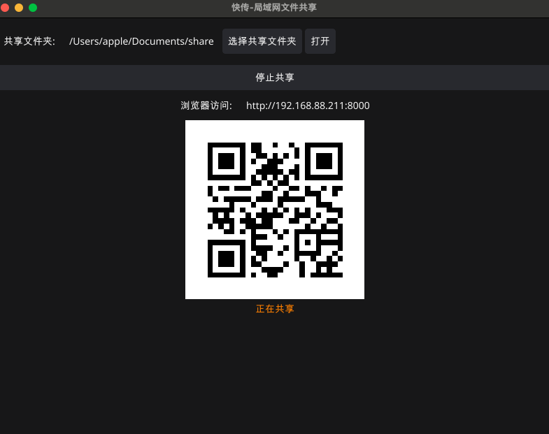
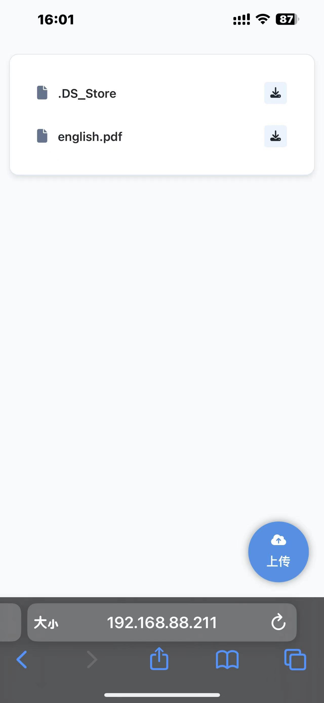

# 快传-局域网文件传输工具

一款**局域网**文件传输工具，支持电脑、手机等多设备跨平台互传，彻底解决大文件传输慢、依赖数据线/外网的核心痛点，让设备间文件共享更高效。

## 技术栈
html+golang+fyne

## 📌 核心功能
| 功能特性 | 详细说明 |
|----------|----------|
| 🚀 局域网高速传输 | 传输速度仅受局域网网络限制（GB级大文件秒传） |
| 🔗 全平台兼容 | 支持 **Windows/macOS（电脑端）** 与 **Android/iOS（手机端）**，任意同局域网设备文件互传 |
| 📁 全类型文件支持 | 无格式/大小限制，可传输图片、视频、文档（Word/Excel/PDF）、安装包（APK/EXE）、压缩包等任意文件 |
| 📱 极简操作流程 | 无需注册登录，打开软件即可通过「扫码连接」 |
| 📊 实时进度监控 | 传输界面清晰展示「当前速度、已传大小、剩余时间、进度条」，状态可视化，避免等待焦虑 |
| 🔒 本地安全传输 | 文件仅在局域网内点对点传输，不经过任何第三方服务器，有效保护隐私数据不泄露 |

## 🚀 快速开始
只需2步，完成多设备文件互传：

1. **环境准备**：确保所有待传输设备（如电脑+手机、手机+手机）连接到**同一个WiFi/局域网**（无需外网）。
2. **开始传输**：
   - 在「发起端设备」（如电脑）打开软件，选择共享文件夹，点击开始共享，界面将生成专属**分享二维码**
   - 在「接收端设备」（如手机）直接扫描发起端的二维码，或浏览器输入页面网址例如：192.168.88.211:8000：

### 电脑端截图

### 手机端截图

## 📥 下载方式
| 设备类型 | 下载链接/获取方式 | 备注 |
|----------|-------------------|------|
| Windows | [Windows安装包](./releases/tag/1.0.0) | 支持 Windows 系统 |
| macOS | [Macos安装包](./releases/tag/1.0.0) | 支持 macOS 系统 |

## ❓ 常见问题（FAQ）
- **Q1：网址打不开？**  
  A1：1. 检查所有设备是否在**同一局域网**（可通过查看设备IP地址确认，如电脑IP：192.168.1.100，手机IP需为192.168.1.x网段）；2. 关闭设备防火墙（尤其是电脑端）；3. 重启软件后重新尝试连接。

- **Q2：电脑查看传输过来的文件？**  
  A2：电脑端点击‘打开’按钮即可

# 捐助

为什么要捐助？一篇好文章可以帮助你节省大量的时间，而你的时间是相当宝贵的。
向文章的作者提供小额捐助，可以鼓励作者写出更好的文章。这是一种良性循环，现在就行动吧！
鼓励留言，让我认识你。

## 📄 许可证
本项目基于 **MIT 许可证** 开源，允许个人/企业免费使用、修改、二次开发，但需保留原作者版权信息。详见 [LICENSE](./LICENSE) 文件。

---

**声明**：本工具仅用于局域网内合法文件传输，请勿用于传输侵权、违法等违规内容，使用过程中因违规操作导致的法律责任，由使用者自行承担。
